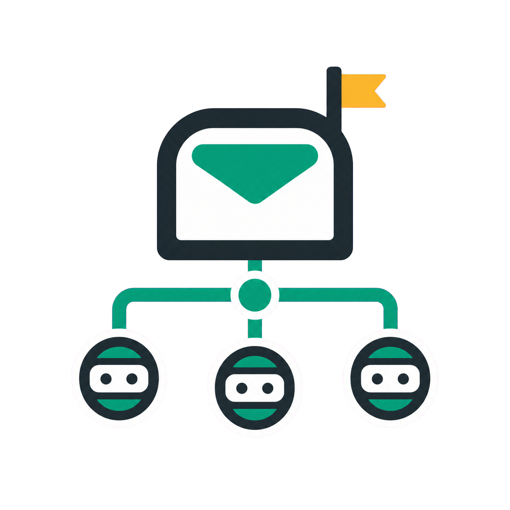

<p align="center">
  <br>
  <strong>Every Harness</strong><br>
  <sub>Codex Skill + CLI delegation across local agent harnesses.</sub>
</p>

<p align="center">
  <a href="LICENSE"></a>
  
  
</p>

---

**Every Harness** is a Codex-facing root `SKILL.md` plus one local CLI, `every-harness`. The Skill teaches Codex when to delegate; the CLI handles `run`, `status`, `cancel`, mailbox state, and harness adapters.

It is not a slash-command toolkit. It does not register MCP servers, hooks, or hidden setup commands.

## Installation

Every Harness has two installed pieces:

- `SKILL.md` is copied into the Codex skill directory.
- `package.json` exposes the `every-harness` executable through npm.

From this checkout, install both:

```bash
scripts/install.sh
every-harness --help
every-harness run --harness fake --json smoke
```

For live development, link the CLI and refresh only the Skill copy:

```bash
npm link
scripts/install.sh --no-cli
```

Manual installation is also just those two steps:

```bash
npm install -g .
CODEX_ROOT="${CODEX_HOME:-$HOME/.codex}"
mkdir -p "$CODEX_ROOT/skills/every-harness"
cp SKILL.md "$CODEX_ROOT/skills/every-harness/SKILL.md"
```

External harness CLIs are not bundled. Install and authenticate whichever harnesses you want to route to:

| Harness | Required local command |
| --- | --- |
| Claude Code | `claude` |
| Antigravity | `agy` |
| OpenCode | `npx opencode-ai` or `opencode` |
| OpenClaw | `openclaw` |
| CodeWhale | `codewhale` |
| Kimi Code | `kimi` |
| Qoder | `qodercli` |
| TRAE | `traecli` |
| GitHub Copilot | `copilot` |
| Cursor | `cursor-agent` |
| Kiro | `kiro-cli` |

## Architecture

<table>
  <tbody>
    <tr>
      <td align="center" colspan="3">
        <strong>Agent Skill</strong><br>
        <sub><code>SKILL.md</code> delegation playbook</sub>
      </td>
    </tr>
    <tr>
      <td align="center" colspan="3">↓</td>
    </tr>
    <tr>
      <td align="center">
        <strong><code>every-harness</code> CLI</strong><br>
        <sub>run / status / cancel</sub>
      </td>
      <td align="center">→</td>
      <td align="center">
        <strong>Mailbox State</strong><br>
        <sub>local workspace-scoped job records</sub>
      </td>
    </tr>
    <tr>
      <td align="center" colspan="3">↓</td>
    </tr>
    <tr>
      <td align="center" colspan="3">
        <strong>Adapter Routing</strong><br>
        <sub>ACP, native stream JSON, and native text adapters</sub>
      </td>
    </tr>
    <tr>
      <td align="center" colspan="3">↓</td>
    </tr>
    <tr>
      <td align="center" colspan="3">
        <strong>External Harness</strong><br>
        <sub>scoped executor already installed on PATH</sub>
      </td>
    </tr>
  </tbody>
</table>

The primary agent remains the planner. A selected harness owns scoped execution. `every-harness` owns local mailbox state, status rendering, cancellation, and adapter routing.

## Usage

```bash
every-harness --help
every-harness run --help
every-harness status --help
every-harness cancel --help
```

### Examples

```bash
# Delegate a code review to Claude Code
every-harness run --harness claude-code --read-only review the auth module

# Run a background task with Kimi Code
every-harness run --harness kimi-code --background summarize this repo

# Write mode with Antigravity
every-harness run --harness antigravity --write fix the failing parser test

# Check all active jobs
every-harness status --all

# Cancel a specific harness
every-harness cancel --harness kimi-code
```

### Commands

| Command | Purpose |
| --- | --- |
| `every-harness run --harness <id> [options] <task>` | Delegate scoped work |
| `every-harness status [options]` | Inspect mailbox jobs |
| `every-harness cancel [options]` | Cancel active delegated work |

## Supported Harnesses

| Harness | `--harness` | Protocol |
| --- | --- | --- |
| Claude Code | `claude-code` | Native stream JSON |
| Antigravity | `antigravity` | Native text |
| OpenCode | `opencode` | ACP |
| OpenClaw | `openclaw` | ACP |
| CodeWhale | `codewhale` | Native stream JSON |
| Kimi Code | `kimi-code` | Native stream JSON |
| Qoder | `qoder` | ACP |
| TRAE | `trae` | ACP |
| GitHub Copilot | `copilot` | ACP |
| Cursor | `cursor` | ACP |
| Kiro | `kiro` | ACP |

> **Note:** Antigravity is limited to text headless mode (`agy --print`). ACP, JSON, and streaming contracts are not confirmed.

## Development

```bash
npm test            # Run unit tests
npm run check       # Lint + tests
npm run smoke:fake  # Smoke test with fake adapter
npm run pack:dry-run # Verify package contents
```

## Privacy

Every Harness stores mailbox metadata locally under `~/.every-harness` by default. Set `EVERY_HARNESS_DATA` to choose another state directory. External prompts, selected repository context, and command output are sent only to the selected harness adapter and the harness CLI or protocol it controls.

## License

Apache-2.0 -- See [LICENSE](LICENSE) and [NOTICE](NOTICE).
