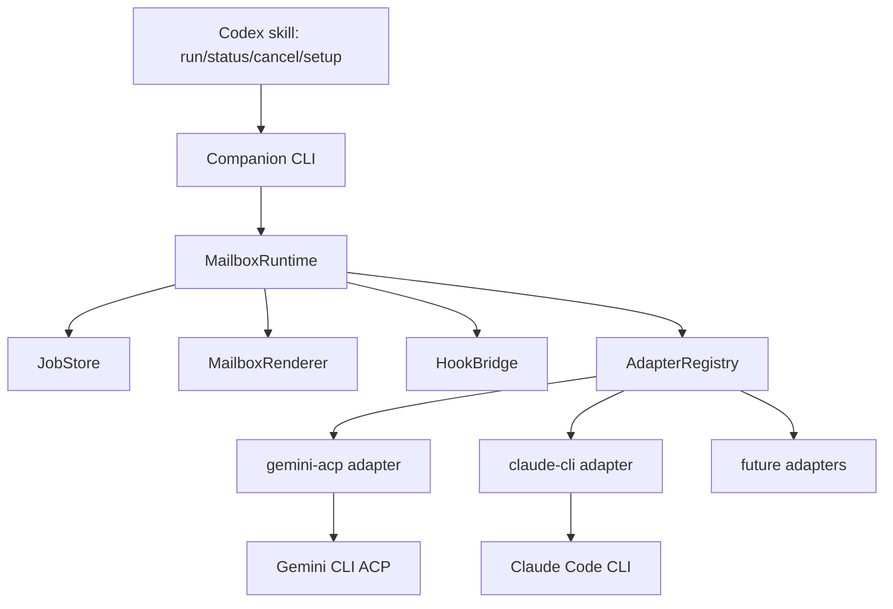

# Every Harness Plugin Design

Date：2026-05-26

Status：draft for user review

## Goal

Build `every-harness-plugin-codex` as a Codex plugin that lets Codex delegate scoped work to other agent harnesses while keeping a single mailbox workflow for `run`、`status`、`cancel`、`setup`。The design is model-agnostic：models are adapter parameters, not core runtime concepts.

## Non-Goals

- Do not build a universal black-box controller that can safely operate any unknown CLI without configuration.
- Do not preserve historical compatibility for legacy `review`、`task`、`result` public commands unless explicitly requested.
- Do not expose raw job files, log paths, PIDs, session IDs, or internal routing flags in ordinary status output.
- Do not write deprecated `[features].codex_hooks`。

## Recommended Approach

Use a shared `MailboxRuntime` plus pluggable `HarnessAdapter` implementations.

Alternatives considered：

1. Copy one plugin per harness into a monorepo.
   - Advantage：fast first commit.
   - Cost：duplicates state, hooks, installer, renderer, and tests. It does not scale to “any Harness”。
2. Build only a dynamic shell-command runner.
   - Advantage：generic.
   - Cost：weak cancellation, weak progress parsing, unclear auth, and poor safety.
3. Shared runtime with typed adapters.
   - Advantage：reuses proven mailbox behavior while isolating harness-specific protocols. This is the recommended path.

## Architecture



Core runtime responsibilities：

- Parse public command arguments.
- Resolve harness selection.
- Enforce one active job per owner session unless explicitly allowed.
- Create, update, list, and cancel jobs.
- Run foreground and background workers.
- Sanitize output.
- Install and validate hooks.
- Keep hook feature enablement on `[features].hooks`。

Adapter responsibilities：

- Probe binary and auth.
- Normalize model and effort values.
- Convert read/write mode into harness-specific permission behavior.
- Execute a prompt and normalize progress.
- Return final text and structured output.
- Cancel a live session or process.
- Provide optional review gate behavior.

## Public Interface

Plugin name：`every-harness`。

Public skills：

- `$every-harness:setup [--harness <id>] [--enable-review-gate|--disable-review-gate]`
- `$every-harness:run --harness <id> [--wait|--background] [--write|--read-only] [--model <model>] [--effort <effort>] [--prompt-file <path>] [task text]`
- `$every-harness:status [--harness <id>] [--all] [--wait]`
- `$every-harness:cancel [--harness <id>]`

Harness IDs for the first release：

- `gemini-acp`
- `claude-cli`
- Optional aliases：`gemini` and `cc`，if they do not create ambiguity.

Default behavior：

- If exactly 1 harness is configured and available, `run` may use it by default.
- If multiple harnesses are available and no default is configured, `run` asks for `--harness <id>`。
- `status` without `--harness` summarizes all harnesses in the current workspace.

## State Model

All state lives in the `every-harness` plugin data namespace.

State layout：

```text
PLUGIN_DATA/
  state/
    <workspace-hash>/
      config.json
      current-session.json
      jobs/
        <job-id>.json
        <job-id>.log
```

Job records contain：

- `id`
- `harnessId`
- `status`
- `createdAt`
- `updatedAt`
- `ownerSessionId`
- `workspaceRoot`
- `mode`
- `model`
- `effort`
- `phase`
- `summary`
- private `processRef` and `providerMetadata`
- sanitized `result` and `rendered`

Terminal statuses：

- `completed`
- `failed`
- `cancelled`
- `cancel_failed`

Active statuses：

- `queued`
- `running`
- `cancelling`

## Adapter Contract

```ts
export interface HarnessAdapter {
  id: string;
  displayName: string;
  defaultModel?: string;

  checkAvailability(context: AdapterContext): Promise<Availability>;
  checkAuth(context: AdapterContext): Promise<AuthStatus>;
  normalizeModel(input?: string): string | undefined;
  normalizeEffort?(input?: string): string | undefined;

  runTurn(request: RunRequest, callbacks: RunCallbacks): Promise<RunResult>;
  cancel(request: CancelRequest): Promise<CancelResult>;
  runReview?(request: ReviewRequest, callbacks: RunCallbacks): Promise<RunResult>;
}
```

The adapter contract must not leak raw provider event shapes into the runtime. Progress is normalized to：

```ts
export interface ProgressEvent {
  message: string;
  phase?: "starting" | "responding" | "tool" | "retry" | "done" | "failed";
  threadId?: string;
  turnId?: string;
  touchedFiles?: string[];
}
```

## Built-In Adapters

### `gemini-acp`

Execution model：

- Probe `gemini --version`。
- Start `gemini --acp` or `gemini --experimental-acp` based on version detection.
- Use ACP `session/new` or `session/load`。
- Set mode and model.
- Send `session/prompt`。
- Convert `agent_message_chunk` to `responding` and `tool_call` to `tool`。
- Try `session/cancel` first, then terminate the process tree when needed.

Open design fix：

- Replace the current weak auth assumption with a real prompt-level readiness check or a clearly labeled “binary-only” readiness result.
- Make permission auto-approval an explicit adapter policy.

### `claude-cli`

Execution model：

- Probe `claude --version` and `claude auth status`，or detect `ANTHROPIC_API_KEY`。
- Spawn `claude -p` with `--output-format stream-json` and stream parser.
- Use sandbox settings and allowed tools for read-only mode.
- Use detached process groups and PID identity validation for cancellation.
- Convert stream text to `responding`，tool use to `tool`，API retry to `retry`。

Open design fix：

- Keep Claude tool whitelist inside the adapter.
- Keep touched file extraction provider-private unless surfaced through sanitized summaries.

## Hooks

The plugin bundles `hooks/hooks.json` and does not rely only on global `~/.codex/hooks.json` mutation.

Required hook events：

- `SessionStart`：record session routing context.
- `SessionEnd`：clean stale active jobs owned by the ending session.
- `UserPromptSubmit`：notify about unread background results.
- `Stop`：optional review gate when enabled.

Hook setup rules：

- Use official `[features].hooks` only.
- Remove or ignore `[features].codex_hooks` during config repair.
- Use `PLUGIN_ROOT` and `PLUGIN_DATA` for plugin-bundled hooks.
- Tell the user when hooks are installed but not yet trusted.

## Error Handling

Common failures should render as short actionable reasons：

- harness unavailable
- auth unavailable
- no prompt provided
- unknown harness
- active job already exists
- model unsupported
- execution timed out
- protocol parse failure
- cancellation could not confirm process termination

Errors stored in private job files may be richer than public output. Public JSON follows the same sanitization rules as public text.

## Testing Strategy

Unit tests：

- argument parser
- harness selection
- model and effort normalization
- job state transitions and CAS failures
- renderer sanitization
- hook config migration from `codex_hooks` to `hooks`
- fake adapter success, failure, progress, cancellation

Integration tests：

- `setup --json` with fake adapters
- foreground `run --json`
- background `run --background` plus `status`
- `status --wait`
- cancellation before worker start, while running, and after completion race
- hook scripts with temporary `CODEX_HOME` and `PLUGIN_DATA`

Smoke tests：

- real `gemini-acp` if Gemini CLI and credentials are available
- real `claude-cli` if Claude Code CLI and auth are available

## Delivery Slices

1. Planning and scaffold：create plugin skeleton, package scripts, lint/typecheck/test config.
2. Runtime extraction：implement fake-adapter backed `MailboxRuntime` and tests.
3. Adapter registry：implement config and harness selection.
4. Gemini adapter：port ACP logic.
5. Claude adapter：port stream CLI logic.
6. Hooks and installer：bundle hooks, setup, marketplace flow, and `[features].hooks` repair.
7. Documentation and release：README, migration notes, changelog, package dry run.

## Acceptance Criteria

- `npm run check` passes.
- `node scripts/every-harness-companion.mjs setup --json` reports configured harnesses.
- Fake adapter tests cover foreground, background, status, wait, cancel, and hook flows.
- `gemini-acp` and `claude-cli` adapters can be selected explicitly by `--harness`。
- Hook install and setup never generate `[features].codex_hooks`。
- Plugin manifest validates and exposes skills from `./skills/`。
- Public output does not expose internal IDs, log paths, PIDs, or raw stored job records.
